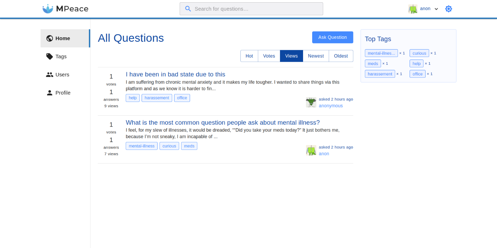
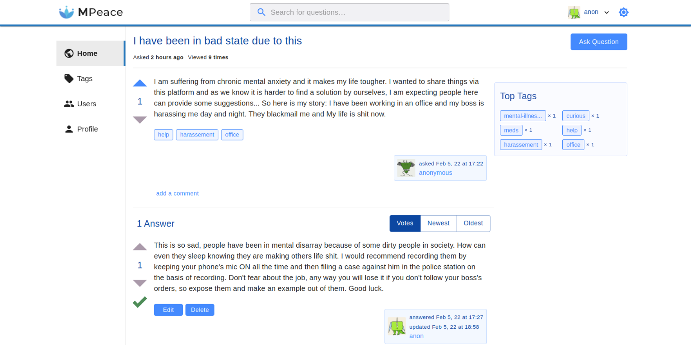
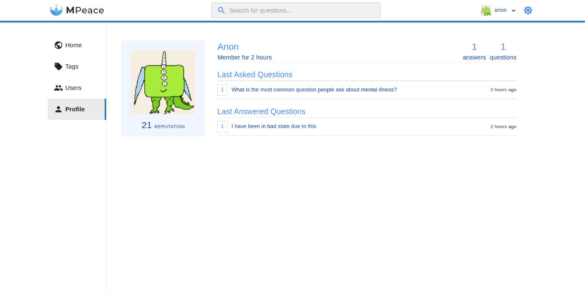
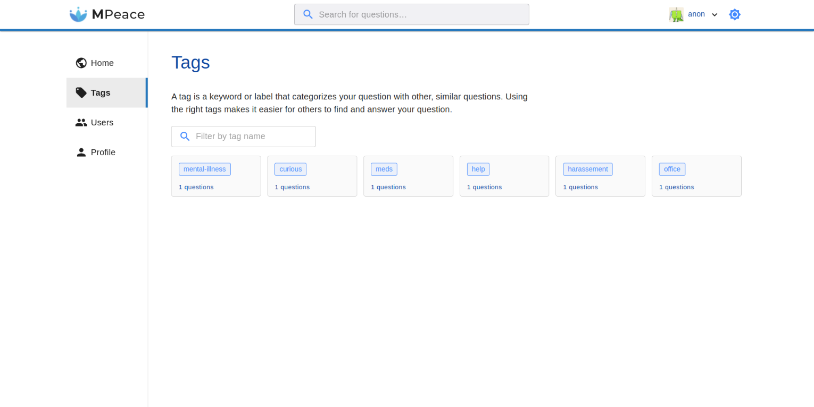
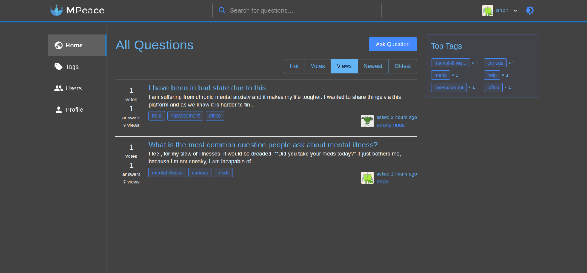
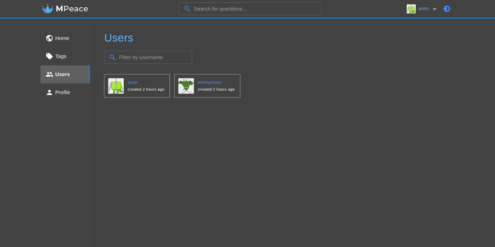
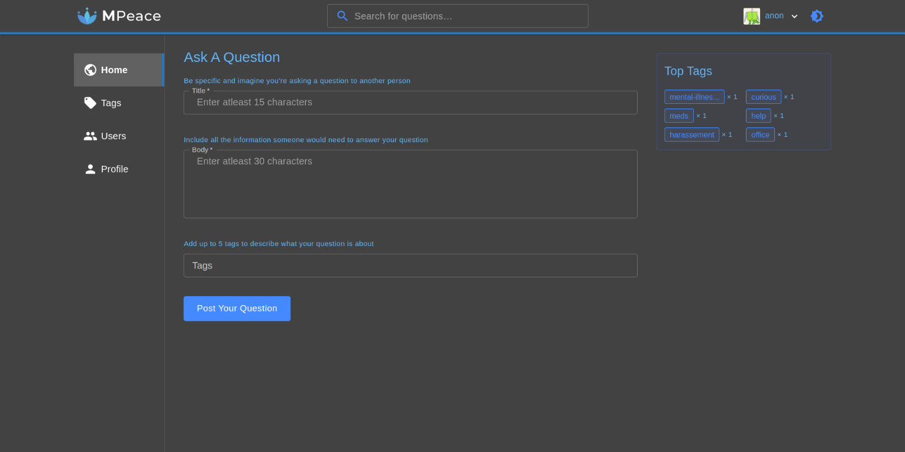

  

# MPeace


[](https://mpeace.vercel.app)

## What is MPeace?

A QnA platform inspired by StackOverflow but dedicated to
mental health support where users can ask about their problems anonymously and achieve mental peace.

## Overview  









## Features 

- Authentication (login/register with username-password)
- CRUD questions, answers & comments
- Upvote/downvote questions & answers
- Tags for organising questions
- Page views - A view is registered whenever the question page is opened
- Sorting of questions on basis of hot, votes, views, newest & oldest
- Search questions over the server on basis of question title & body
- Pagination of posts in the form of "Load More" button
- Error management to prevent app crashes
- Toast notifications for actions: adding questions, deleting comments etc.
- Proper responsive UI for all screens and Dark Mode.

## Project setup 💻

```bash
> Cloning the repo
    >> git clone https://github.com/harshkc/mpeace.git
    >> cd mpeace
> Install all client dependencies from client directory
    >> cd client
    >> yarn install
> Install all server dependencies from server directory
    >> cd server
    >> yarn install   
> Start the server on localhost:5000
    >> cd server
    >> touch .env
    >> copy the variable name from .env.example
    >> set your own API keys
    >> yarn start
> Setup the env variable in client directory
    >> cd client
    >> touch .env 
    >> copy the variable name from .env.example
    >> set the value to 'https://localhost:5000'
> Start the app on localhost:3000
    >> cd client
    >> yarn start

```